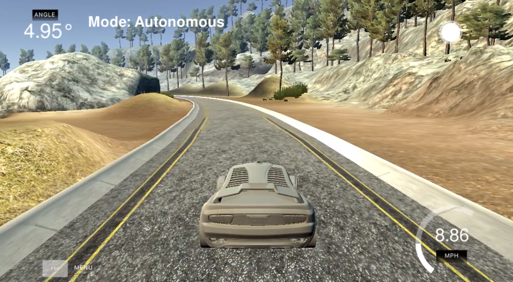
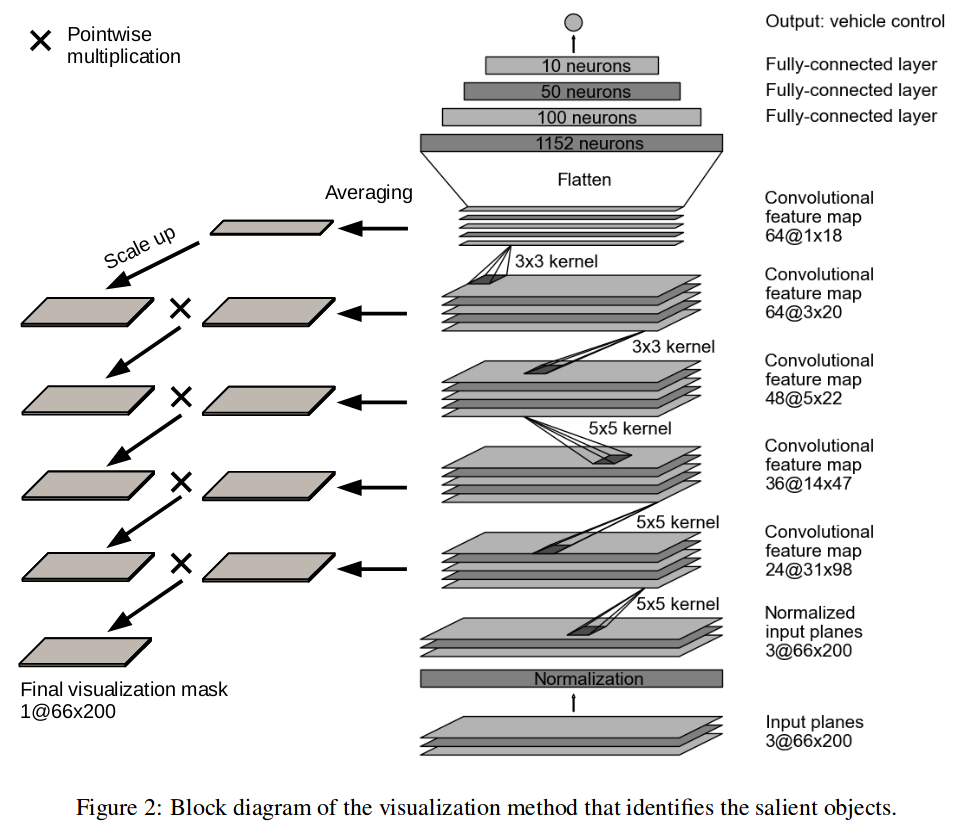
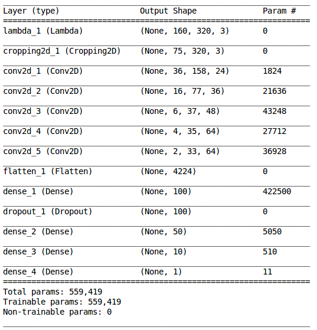
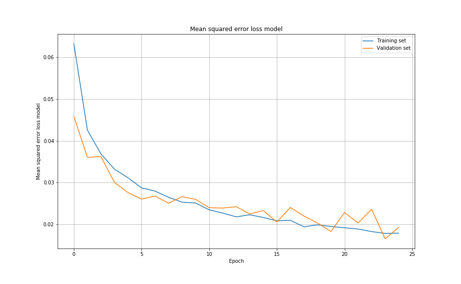
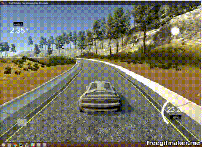
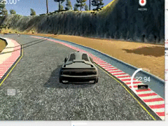
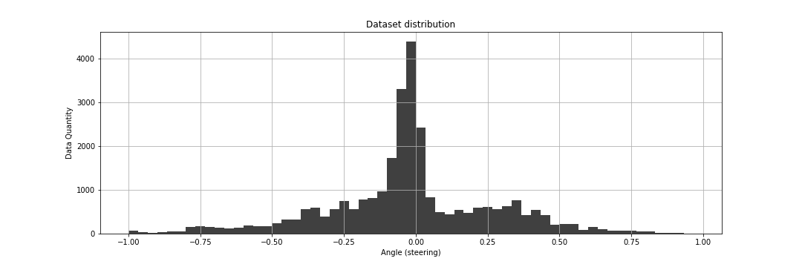
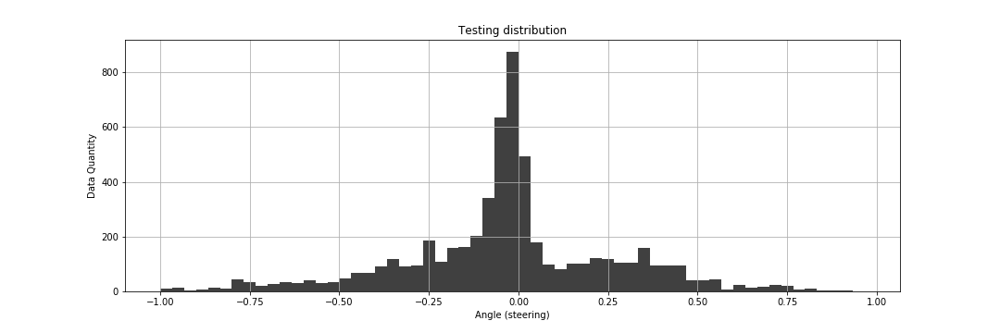
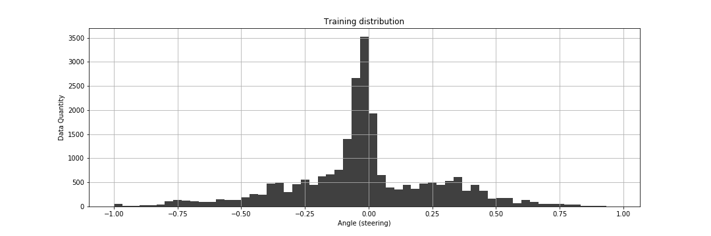

# **Behavioral Cloning Project**

[](http://www.udacity.com/drive)

The main objective of this project is to apply the knowledge in deep neural networks and the convolutional networks to clone the behavior of a car in a test road. The car has a central camera, a front left, and a front right. These images will be the input to the neural network and we have the angle of rotation of the car as output. The main idea is to capture data using the [Udacity simulator](https://github.com/udacity/self-driving-car-sim) and then train a neural network that clones the way of driving so that the car can successfully complete the road.
The model is trained and validated using the Keras Framework.



## Rubric Points
---
Here I will consider the [rubric points](https://review.udacity.com/#!/rubrics/432/view) individually and describe how I addressed each point in my implementation.  

## Files Submitted & Code Quality

#### 1. Submission includes all required files and can be used to run the simulator in autonomous mode

My project includes the following files:
* The [`CarND-Behavioral-Cloning-P3.ipynb`](CarND-Behavioral-Cloning-P3.ipynb). Script used to create and train the model.
* The [`CarND-Behavioral-Cloning-P3.md`](CarND-Behavioral-Cloning-P3.md). Report writeup file.
* The [`drive.py`](drive.py). Script to drive the car in autonomous mode.
* The [`behavioral_model.h5`](model/behavioral_model.h5). This file contains a trained convolution neural network. 
* The [`Video1.mp4`](Track1.mp4). Video with autonomous driving over track 1.
* The [`Video2.mp4`](Track2.mp4). Video with autonomous driving over track 2.

#### 2. Submission Includes Functional Code
Using the Udacity provided [simulator](https://github.com/udacity/self-driving-car-sim) and my `drive.py` file, the car can be driven autonomously around the track by executing:

```sh
python drive.py model.h5
```

#### 3. Submission code is usable and readable

The `CarND-Behavioral-Cloning-P3.ipynb` notebook file contains the code for training and saving the convolution neural network. The file shows the pipeline I used for training and validating the model, and it contains comments to explain how the code works.

## Model Architecture and Training Strategy

#### 1. An Appropriate Model Architecture Has Been Employed

The model has a fairly common architecture, in fact, I used a model provided by NVIDIA, which is pretty good for autonomous cars.



The detail of the used architecture is, in the first one there is a Lambda layer that normalizes the input image, later a Cropping is done. Next, we have 5 layers, followed by a normalization layer with a ReLu activation function.

   

The total parameters to train the neural network is around 559.419. 

#### 2. Attempts to reduce overfitting in the model

The model contains dropout layers in order to reduce overfitting. The model was trained and validated on different data sets to ensure that the model was not overfitting. The model was tested by running it through the simulator and ensuring that the vehicle could stay on the track.

#### 3. Model parameter tuning

The model used an adam optimizer, so the learning rate was not tuned manually.
I trained the model with Epochs = 25, Generator batch size = 128, Correction factor = 0.2, Up limit and down limit set as 65 and 20 respectively, Learning Rate as default 0.001, Validation Data split 0.20.

## Model Architecture and Training Strategy

#### 1. Solution Design Approach

The overall strategy for deriving a model architecture was to test the model in the simulator and see how it works. There were parts of the track where the car was lost from the road, therefore, more data was collected generating unexpected movements so that there was another behavior in the characteristics of the images. Basically, the strategy was to try and take additional data from the areas where the car lost its way.

Next, a training chart is shown (final model). This chart shows the difference between the data set of Training and Validation with a low mean square error. 
In order to gauge how well the model was working, I split my image and steering angle data into a training and validation set. I found that my first model had a low mean squared error on the training set and a low mean squared error on the validation set. This implied that the model was not overfitting.



#### 3. Creation of the Training Set & Training Process

To capture good driving behavior, I first recorded two laps on track one using center lane driving. Here is an example image of center lane driving:



I then recorded the vehicle recovering from the left side and right sides of the road back to center so that the vehicle would learn to identify the lane lines and its correction.



Then I repeated this process on track two in order to get more data points.

To do the training it was decided to mess up the image dataset and separate the training and validation data. This in order to be able to compare the mean square error in the training graph.

The histogram of the distribution of the data is shown below.



In this histogram, we observe how there is a Gaussian distribution of mean 0, which is good for our model.
The next histogram shows the distribution for the Testing set:



The next histogram show the distribution for the Training set:



One technique to increase the width of the Gaussian bell is to use Data Augmentation, it is basically to process the data previously taken, generate rotations, color interferences, inverted images in order to increase the data and enrich the training model.